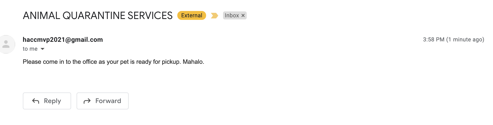

# Nodemailer Setup Guide

This guide walks through how to enable access to programmatically query send emails using a Google Account with [Nodemailer](https://nodemailer.com/). This step is required to send emails to users on the `http://localhost:5000/notify` route.

## End State
* A `.env` file located at the root of this project's file structure
* The `http://localhost:5000/notify` route sending notification emails to a valid `email` field on valid `POST` requests.



## Instructions
1. Ensure you have access to the team Google Account (`HACCMVP2021@gmail.com`)
> Credentials are available in Slack (team channel)
2. Locate the `sample.env` file located in the current project file structure

The current file structure should look like
```
...
src/
public/
scripts/
sample.env # <- It is this file right here
```
3. Copy this file over while renaming it to `.env`
> Example: `cp sample.env .env`

Your  file structure should now look like
```
...
src/
public/
scripts/
sample.env # <- Original `sample.env` file
.env # <- New `.env` file
```

4. Edit this file and change the contents of the `GOOGLEACC_USER` and `GOOGLEACC_PASS` variables.
> For the purpose of HACC, these should be the username/password of the team google account.

5. Notification emails will now be sent when valid `email` addresses are passed through a `POST` request to the `/notify` route.
> Example: `http post localhost:5000/notify email=dog_lover_123@gmail.com`

## Appendix
* [Nodemailer Invalid login: 535-5.7.8 Username and Password not accepted.](https://stackoverflow.com/questions/45478293/username-and-password-not-accepted-when-using-nodemailer)