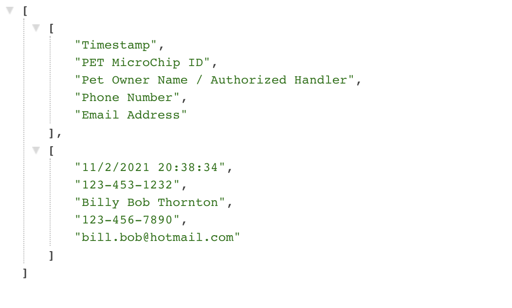
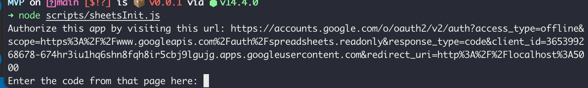

# Sheets Setup Guide

This guide walks through how to enable access to programmatically query the Google Sheets API. This step is required to serve form responses on the `http://localhost:5000/data` route locally.

## End State
* A `google-credentials.json` and a `token.json` file generated at the root of this project's file structure
* The `http://localhost:5000/data` returning a result of the following form




## Instructions
1. Ensure you have access to the team Google Account (`HACCMVP2021@gmail.com`)
> Credentials are available in Slack (team channel)
2. Retrieve and save the `google-credentials.json` file in the root of this project's file structure (also in Slack team channel)

Your file structure should look like
```
...
src/
public/
scripts/
google-credentials.json # <- Save to right here!
```
3. Run the [sheets setup script](../../scripts/sheetsInit.js)
> Example: `node scripts/sheetsInit.js`

You should be prompted with the following prompt:



4. Click the link and authorize the app by signing into the team Google account
> This should redirect you to the `http://localhost:5000` domain

5. Copy the code from the url
> The redirected url should look something like `http://localhost:5000?code=...&client_id=...`
> The generated code from the URL may contain special URL encoded characters.  
> So go to https://www.urldecoder.io/ and decode the string, then paste it back into the terminal.
> Make sure you do not copy the `&` symbol, as that is not apart of the code.

6. Enter that code into your terminal awaiting prompt, and your `token.json` file should now be generated

Your resulting file structure should look like
```
...
src/
public/
scripts/
google-credentials.json
token.json # <- Generated right here!
```

## FAQ

#### What should my `google-credentials.json` file look like?
The `google-credentials.json` file should be of the following form:

```json
{
    "web": {
        "client_id": "XXX.apps.googleusercontent.com",
        "project_id": "teammvp",
        "auth_uri": "https://accounts.google.com/o/oauth2/auth",
        "token_uri": "https://oauth2.googleapis.com/token",
        "auth_provider_x509_cert_url": "https://www.googleapis.com/oauth2/v1/certs",
        "client_secret": "XXX",
        "redirect_uris": ["http://localhost:5000"]
    }
}
```

#### What should my `token.json` file look like?
The `token.json` file should be of the following form:

```json
{
    "access_token": "XXX",
    "refresh_token": "XXX",
    "scope": "https://www.googleapis.com/auth/spreadsheets.readonly",
    "token_type": "Bearer",
    "expiry_date": 1635923151642
}
```
