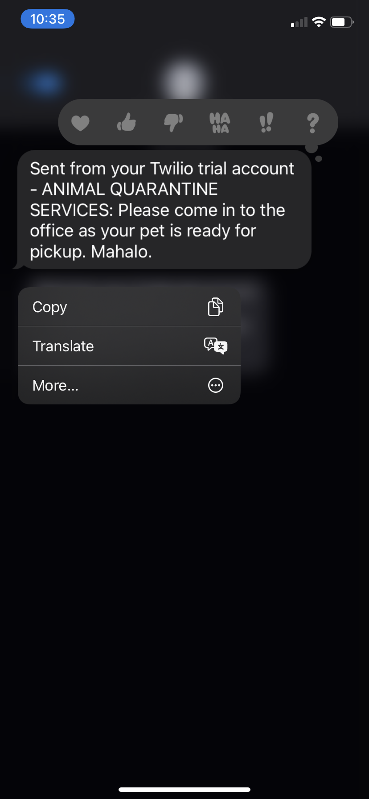

# Twilio Setup Guide

This guide walks through how to enable access to programmatically query send sms messages using a free tier account with [Twilio](https://www.twilio.com/try-twilio/). This step is required to send sms messages to users on the `http://localhost:5000/sms` route.

## End State
* A `.env` file located at the root of this project's file structure
> Relevant .env fields: `TWILIO_ACCOUNT_SID`, `TWILIO_AUTH_TOKEN`, `TWILIO_PHONE_NUMBER`
* The `http://localhost:5000/sms` route sending notification sms messages to a valid `phoneNumber` field on valid `POST` requests.

## Instructions
1. Sign up for an account with Twilio under the [Free Trial plan](https://support.twilio.com/hc/en-us/articles/223136107)
2. Follow the guide, and retrieve an Account SID, Auth Token, and a Phone Number
3. Edit the relevant environment fields in your local `.env` file
> You can see sample values in `sample.env`
4. SMS messages will now be sent when valid `phoneNumber` addresses are passed through a `POST` request to the `/sms` route.
> Example: `http post localhost:5000/sms phoneNumber=8083211234`

## Appendix
* [Twilio REST API Guide](https://www.twilio.com/docs/usage/api)
* [Twilio Node SDK Library](https://www.twilio.com/docs/libraries/node)